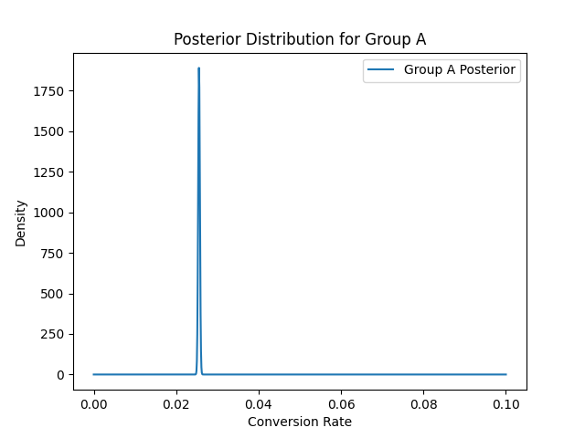
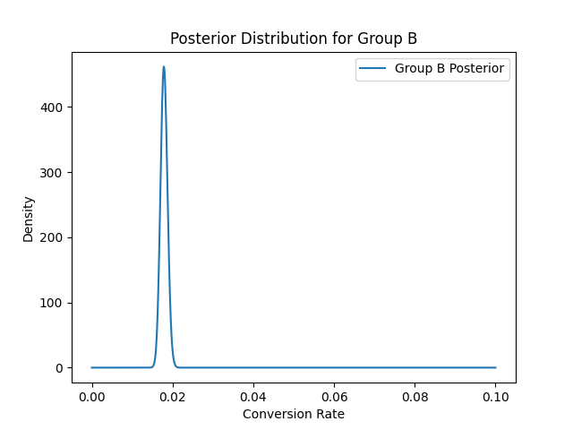

# Bayesian A/B Testing Project

## Table of Contents
- [Overview](#overview)
- [Dataset](#dataset)
- [Project Structure](#project-structure)
- [Key Results](#key-results)
  - [Conversion Rates](#conversion-rates)
  - [Bayesian A/B Test Result](#bayesian-ab-test-result)
  - [Posterior Distributions](#posterior-distributions)
- [Visualizations](#visualizations)
- [Conclusion](#conclusion)
- [Future Work](#future-work)

## Overview
This project implements Bayesian A/B testing on a marketing dataset to compare the conversion rates of two test groups (e.g., Ad Group vs. PSA Group). The goal is to use Bayesian inference to make more informed decisions about which group performs better, taking uncertainty into account.

We use Monte Carlo simulations to estimate the probability that one group outperforms the other, and credible intervals are used to visualize the uncertainty in the estimates.

### Dataset
The dataset used in this project is stored in `data/marketing_AB.csv`. It contains the following columns:
- `user id`: Unique identifier for each user.
- `test group`: Specifies whether the user is in the "ad" group or "PSA" group.
- `converted`: Indicates whether the user converted (1) or not (0).
- `total ads`: Number of ads shown to the user.
- `most ads day`: Day of the week when the user saw the most ads.
- `most ads hour`: Hour of the day when the user saw the most ads.

## Project Structure
- `data/`: Contains the dataset (`marketing_AB.csv`).
- `src/`: Contains the source code:
  - `data_loader.py`: Loads and preprocesses the data.
  - `bayesian_model.py`: Contains the Bayesian inference model and Monte Carlo simulation functions.
  - `visualizations.py`: Generates visualizations of the posterior distributions.
  - `ab_testing_pipeline.py`: The main script that ties everything together.
- `notebooks/`: Jupyter notebooks for exploratory data analysis (EDA).
- `reports/`: Contains the final report with insights from the A/B test.
- `tests/`: Unit tests to ensure code quality.
- `Dockerfile`: Docker configuration to containerize the project.
- `requirements.txt`: List of Python dependencies required for the project.

### Key Results

#### Conversion Rates
The observed conversion rates from the dataset are as follows:
- **Ad group**: 2.55% conversion rate (14,423 conversions out of 564,577 users).
- **PSA group**: 1.78% conversion rate (420 conversions out of 23,524 users).

#### Bayesian A/B Test Result
Using Bayesian inference, we calculated the posterior distributions for both groups based on a Beta prior distribution and observed data. The posterior distributions were compared using Monte Carlo simulation to estimate the probability that the **PSA group** performs better than the **ad group**.

- **Probability that the ad group conversion rate is higher than the PSA group**: **100%**

This means that, based on the data, the ad group consistently outperforms the PSA group in terms of conversion rate.

### Posterior Distributions
The following plot shows the posterior distributions of the conversion rates for both groups. The **ad group's posterior** is significantly more concentrated and centered around a higher conversion rate (2.55%) compared to the **PSA group's posterior** (1.78%).

### Visualizations
The following plots illustrate the posterior distributions of the conversion rates for both groups:

#### Group A (Ad Group)

#### Group B (PSA Group)

### Conclusion
This project showcases how **Bayesian A/B testing** can be used to make data-driven decisions in a marketing context. With a high degree of certainty in the results, this method provides a clear advantage over traditional frequentist methods. 

The analysis revealed that the **ad group** has a significantly higher conversion rate than the PSA group, with **100% certainty**. These findings suggest that marketing teams should invest more resources into the ad strategy to maximize conversions. 

This framework can easily be scaled to handle more complex scenarios, such as multi-arm bandit problems, continuous testing, and other business metrics, making it a valuable tool for decision-making in real-world applications.
