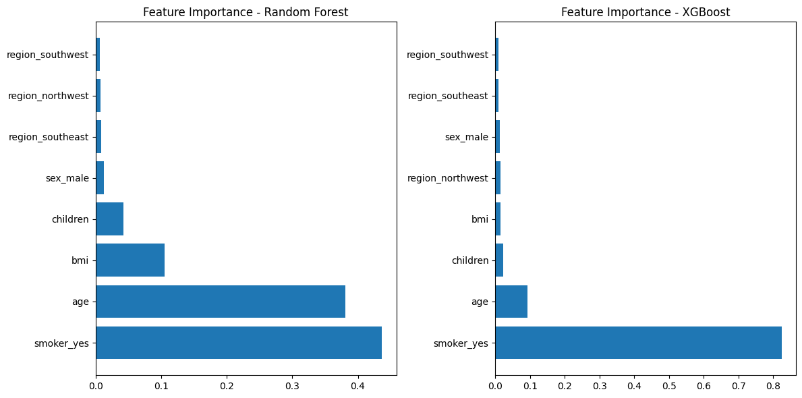

# Actuarial Insurance Pricing Prediction

## Table of Contents
- [Overview](#overview)
- [Dataset](#dataset)
- [Project Structure](#project-structure)
- [Key Results](#key-results)
  - [Model Performance](#model-performance)
- [Visualizations](#visualizations)
- [Airflow Pipeline](#conclusion)

## Overview
This project demonstrates how to build a predictive model for insurance pricing using machine learning techniques. It automates the **ETL (Extract, Transform, Load)** pipeline with **Airflow** and integrates a **Streamlit** web app for users to input data and predict insurance charges. The goal is to predict the charges based on several factors, including age, BMI, smoking habits, and region.

Key machine learning models, such as **Random Forest** and **XGBoost**, were tested to determine the best-performing model. The full pipeline for data preparation, model training, and prediction was built in an automated fashion to mimic production use cases for actuarial data scientists.

## Dataset
The dataset `insurance.csv` consists of several features:
- `age`: The age of the person.
- `sex`: Gender (male/female).
- `bmi`: Body mass index.
- `children`: Number of children.
- `smoker`: Whether the person smokes (yes/no).
- `region`: The geographical region where the person resides.
- `charges`: The actual insurance charges.

The dataset was preprocessed to ensure it was suitable for model training, including transformations such as log transformation of `charges` and one-hot encoding of categorical features.

## Project Structure

├── dags/                      # Airflow DAGs for data processing and model training.
├── data/
│   ├── processed/              # Transformed dataset after ETL steps.
│   └── raw/                    # Original dataset (insurance.csv).
├── model/                      # Contains trained machine learning models.
├── notebooks/                  # Jupyter Notebooks for EDA and model experimentation.
├── reports/                    # Reports and visualizations of model performance.
├── src/                        # Source code, including the Streamlit app.
├── tests/                      # Unit tests for the pipeline and codebase.
└── Dockerfile                  # Dockerfile to containerize the application.

## Key Results

### Model Performance

After hyperparameter tuning, two models were selected for evaluation:

1. Random Forest
  R-squared: 0.845
2. XGBoost
  R-squared: 0.848

XGBoost was chosen as the final model due to its superior performance.

### Visualizations
The following visualizations support the model evaluation and interpretation:

#### Feature Importance (XGBoost)

#### Residual Analysis

## Airflow Pipeline
The ETL pipeline is managed by Airflow and includes the following stages:

- Data Extraction: Raw insurance data is extracted from insurance.csv.
- Data Cleaning: Missing values are handled, and unnecessary columns are removed.
- Feature Engineering: Log transformation of charges and one-hot encoding of categorical variables are applied.
- Data Validation: Ensures that transformed data meets quality criteria (e.g., no negative log-transformed charges).
- Model Training: The model is trained on the processed data and saved for future predictions.

## Streamlit Application
A Streamlit app was created to allow users to interact with the model. Users provide features such as age, BMI, smoking status, etc., and the app predicts insurance charges using the best model (XGBoost)